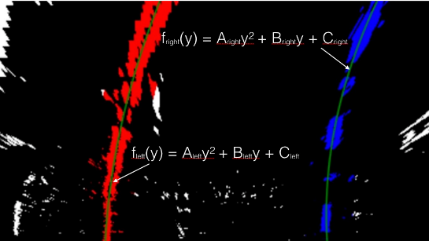

# Advanced Lane Finding


---

**Advanced Lane Finding Project**

The goals / steps of this project are the following:

* Compute the camera calibration matrix and distortion coefficients given a set of chessboard images.
* Apply a distortion correction to raw images.
* Use color transforms, gradients, etc., to create a thresholded binary image.
* Apply a perspective transform to rectify binary image ("birds-eye view").
* Detect lane pixels and fit to find the lane boundary.
* Determine the curvature of the lane and vehicle position with respect to center.
* Warp the detected lane boundaries back onto the original image.
* Output visual display of the lane boundaries and numerical estimation of lane curvature and vehicle position.

[//]: # (Image References)

[image1]: ./examples/undistort_output.png "Undistorted"
[image2]: ./test_images/test1.jpg "Road Transformed"
[image3]: ./examples/binary_combo_example.jpg "Binary Example"
[image4]: ./examples/warped_straight_lines.jpg "Warp Example"
[image5]: ./examples/color_fit_lines.jpg "Fit Visual"
[image6]: ./examples/example_output.jpg "Output"
[video1]: ./project_video.mp4 "Video"

### Code:
This project requires python 3.5 and the following dependecies:
- [NumPy](http://www.numpy.org/)
- [matplotlib](http://matplotlib.org/)
- [OpenCV](http://opencv.org/)
- [MoviePy](http://zulko.github.io/moviepy/)

### Camera Calibration

#### 1. Briefly state how you computed the camera matrix and distortion coefficients. Provide an example of a distortion corrected calibration image.

The code for this step is contained in the second code cell of the IPython notebook located in "P4.ipynb" .

I start by preparing "object points", which will be the (x, y, z) coordinates of the chessboard corners in the world. Here I am assuming the chessboard is fixed on the (x, y) plane at z=0, such that the object points are the same for each calibration image.  Thus, `objp` is just a replicated array of coordinates, and `objpoints` will be appended with a copy of it every time I successfully detect all chessboard corners in a test image.  `imgpoints` will be appended with the (x, y) pixel position of each of the corners in the image plane with each successful chessboard detection.  

I then used the output `objpoints` and `imgpoints` to compute the camera calibration and distortion coefficients using the `cv2.calibrateCamera()` function.  I applied this distortion correction to the test image using the `cv2.undistort()` function and obtained this result: 


### Pipeline (single images)

#### 1. Distortion correction

Just like the undistortion for the chessboard, we applied the `undistort()` function to a test image on the road and got the result:


#### 2. Perspective transform 

The code for my perspective transform includes a function called `per_transform()`, which appears  in the first code cell under the Perspective transform part on the IPython notebook.  I chose the hardcode the source and destination points(src,dst) in the following manner:

```python
src = np.float32([[220,720],[1110,720],[722,470],[570,470]])
dst = np.float32([[320,720],[920,720],[920,1],[320,1]])
```

This resulted in the following source and destination points:

| Source        | Destination   | 
|:-------------:|:-------------:| 
| 220, 720      | 320, 720      | 
| 1110, 720     | 920, 720      |
| 722, 470      | 920, 1        |
| 570, 470      | 320, 1        |

The applied the transform to the test image and we can see the result:


#### 2.Color and Gradient threshold.

I used a combination of color and gradient thresholds to generate a binary image. I created a function `threshold()` to do these. In this function, the input image will first undistrot by the `undistort()` function. Then do the perspective transform as above..Apply gradient threshold(min=20,max=100) on the horizontal gradient to the grayscale image. Convert the RGB image to HLS color space and get the s_channel. Apply threshold(min=90,max=255) to the s_channel. Finally combine the s_channel and the gradient to get the final result.
Here's an example of my output for this step. 


#### 4. Identify lane-line pixels and fit their positions with a polynomial

The method to detect lane line can sperate into two part. The first is to get the histogram of the image on the horizontal direction. We can see that the Peak in the first half indicates the likely position of the left line; the peak in the second half indicates the likely postion of the right line.


The sencond is to apply the sliding window. The window size is 10. The histogram gave us the location of lane lines. We just identify all non zero pixels around histogram peaks using numpy function `numpy.nonzeros()`. Then fit a polynomial to each lane using the numpy fucntion `numpy.polyfit()`. 



#### 5. Describe how (and identify where in your code) you calculated the radius of curvature of the lane and the position of the vehicle with respect to center.

I did this in lines # through # in my code in `my_other_file.py`

#### 6. Provide an example image of your result plotted back down onto the road such that the lane area is identified clearly.

I implemented this step in lines # through # in my code in `yet_another_file.py` in the function `map_lane()`.  Here is an example of my result on a test image:

![alt text][image6]

---

### Pipeline (video)

#### 1. Provide a link to your final video output.  Your pipeline should perform reasonably well on the entire project video (wobbly lines are ok but no catastrophic failures that would cause the car to drive off the road!).

Here's a [link to my video result](./project_video.mp4)

---

### Discussion

#### 1. Briefly discuss any problems / issues you faced in your implementation of this project.  Where will your pipeline likely fail?  What could you do to make it more robust?

Here I'll talk about the approach I took, what techniques I used, what worked and why, where the pipeline might fail and how I might improve it if I were going to pursue this project further.  
