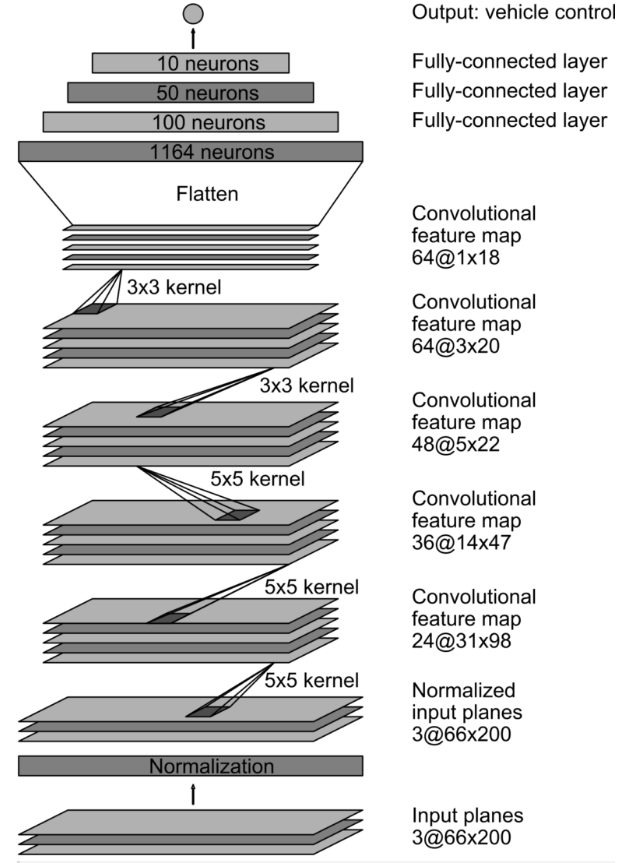
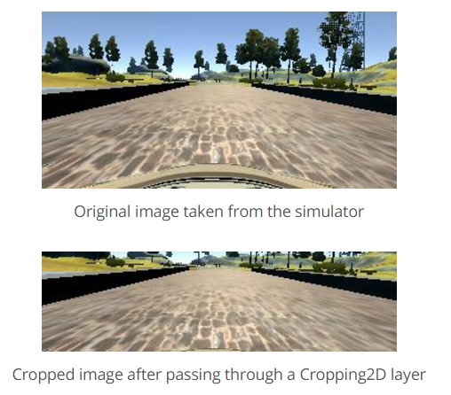
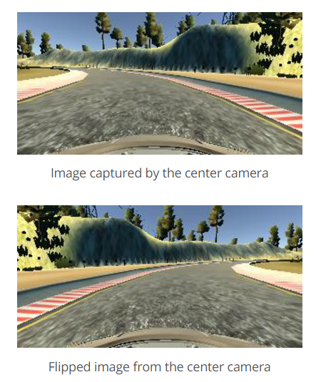

# CarND-Behavioral-Cloning-P3
Yuxiang 2017/7/26


# Prerequisites

Anaconda<br>
tensorflow<br>
Keras 1.2.1<br>
Opencv<br>

# Project

## Goals

The goals/steps of this project are the following:

- Use the simulator to collect data of good driving behavior.
- Build, a convolution neural network in [Keras](https://keras.io/) that predicts steering angles from images.
- Train and validate the model with a training and validation set.
- Test that the model successfully drives around track one without leaving the road.
- Summarize the results with a written report.

## Rubric points

Here I will consider the [rubric points](https://review.udacity.com/#!/rubrics/432/view) individually and describe how I addressed each point in my implementation.

### Files Submitted & Code Quality

#### 1. Submission includes all required files and can be used to run the simulator in autonomous mode
My project includes the following files:

- **model.py** : The python code for the training process and the model architecture.
- **drive.py** : For driving the car in autonomous mode in the simulator (This is provided [Udacity](https://github.com/udacity/CarND-Behavioral-Cloning-P3/blob/master/drive.py)).
- **model.h5** : The trained model to predict the steering angle.
- **README.md** : Report for the pipline and the results

#### 2. Submission includes functional code Using the Udacity provided simulator and my drive.py file; the car can be driven autonomously around the track by executing

```
python drive.py model.h5
```

#### 3. Submission

The model.py file contains the code for training and saving the convolution neural network. The file shows the pipeline I used for training and validating the model, and it contains comments to explain how the code works.

### Model Architecture and Training Strategy

#### 1. The final model architecture 

I refer to the [nvidia Autonomous Car model](https://devblogs.nvidia.com/parallelforall/deep-learning-self-driving-cars/), build it and the car drove the complete first track.

The nvidia model architecture is shown in the following image:



My model input is (160, 320, 3) image. To preprocess the data input, I add a Lambda layer to normalize the input. The Cropping2D layer was add to crop the image. The details will be shown in the data preprocess and augumentation.

The model summary is as follows:

```
Layer (type)                     Output Shape          Param #     Connected to                     
====================================================================================================
lambda_1 (Lambda)                (None, 160, 320, 3)   0           lambda_input_2[0][0]             
____________________________________________________________________________________________________
cropping2d_1 (Cropping2D)        (None, 90, 320, 3)    0           lambda_1[0][0]                   
____________________________________________________________________________________________________
convolution2d_1 (Convolution2D)  (None, 43, 158, 24)   1824        cropping2d_1[0][0]               
____________________________________________________________________________________________________
convolution2d_2 (Convolution2D)  (None, 20, 77, 36)    21636       convolution2d_1[0][0]            
____________________________________________________________________________________________________
convolution2d_3 (Convolution2D)  (None, 8, 37, 48)     43248       convolution2d_2[0][0]            
____________________________________________________________________________________________________
convolution2d_4 (Convolution2D)  (None, 6, 35, 64)     27712       convolution2d_3[0][0]            
____________________________________________________________________________________________________
convolution2d_5 (Convolution2D)  (None, 4, 33, 64)     36928       convolution2d_4[0][0]            
____________________________________________________________________________________________________
flatten_1 (Flatten)              (None, 8448)          0           convolution2d_5[0][0]            
____________________________________________________________________________________________________
dense_1 (Dense)                  (None, 100)           844900      flatten_1[0][0]                  
____________________________________________________________________________________________________
dense_2 (Dense)                  (None, 50)            5050        dense_1[0][0]                    
____________________________________________________________________________________________________
dense_3 (Dense)                  (None, 10)            510         dense_2[0][0]                    
____________________________________________________________________________________________________
dense_4 (Dense)                  (None, 1)             11          dense_3[0][0]                    
====================================================================================================
Total params: 981,819
Trainable params: 981,819
Non-trainable params: 0
```


#### 2. Strategys to reduce overfitting in the model

To overcome the overfitting, the model will only train 5 epochs every time. 
In addition, I use large number of training data to reduce overfitting, and the dataset was shuffled before fit in the model.
To observe the accuracy of validation, I split the dataset into training set and validation set.

#### 3. Model parameter tuning

I used Adam optimizer, the learning rate will automatically adjust according to the training process.

#### 4. Training data

The original dataset is provided by Udacity.
To gather more training dataset for generalizing the model and keep the car run better on the lane, I recorded the runing process 6 times with a car runing safely on the lane. Each record contained both track 1 and track 2. For each track, I recorded at least 3 forward loops and 3 backward loops for each track every record. 

For every samples, the simulator provides three different images: center, left, and right cameras. All of these images was used to train the model.

The totally size of the training data images and csv files is: 2.71 GB


#### 5. Data preprocess and augmentation

**Normalization:** <br>
The pixels for each image are divided by 255 and then substracted 0.5 for zero mean.

 **Cropping:** <br>
The pictures will be crop by the Cropping2D layer in the Keras model.



 **Flipping:** <br>
A effective technique for helping with the left or right turn bias involves flipping images and taking the opposite sign of the steering measurement.



**Bias:**<br>
As the images from left and right images are used, we need to add an bias to the steering angle from these images. The value of the bias is 0.25. The left will add +0.25 and the right will add -0.25.


#### 5. Training process

The final model was trained 7 times by 7 datasets I mentioned above. Everytime a model was train, this model was loaded to train the next dataset.

After this training, the car was driving down the road all the time on the [first](run1.mp4) and [second](run2.mp4) track. 
