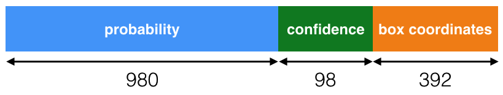

# Vehicle Detection and tracking Project

This is a project for Udacity self-driving car Nanodegree program. The implementation of the project is in the file Vehicle_detection.ipynb.

In this README, each step in the pipeline will be explained in details.

## Dependencies
This project requires python 3.5 and the following dependecies:
- [Keras 1.2.1](https://keras.io/)
- [NumPy](http://www.numpy.org/)
- [matplotlib](http://matplotlib.org/)
- [OpenCV](http://opencv.org/)
- [MoviePy](http://zulko.github.io/moviepy/)

## Introduction to object detection

In this project, we have a video recording the car driving on the highway. The video process can be consider as a number of image process. The vehicle detection is an important part of self driving car. We need to detect the cars which appear in the camera in order to have a safe driving. 

In this project, we will use tiny-YOLO v1, since it's easy to implement and are reasonably fast.


## The tiny-YOLO v1

### Architecture

The tiny YOLO is consist of 9 convolution layers and 3 full connected layers. Leaky relu(alpha = 0.1) and max pooling follow each convolution layer. The first 9 convolution layers can be understood as the feature extractor, whereas the last three full connected layers can be understood as the "regression head" that predicts the bounding boxes.


The model summary is displayed below.

    ____________________________________________________________________________________________________
    Layer (type)                     Output Shape          Param #     Connected to                     
    ====================================================================================================
    convolution2d_1 (Convolution2D)  (None, 16, 448, 448)  448         convolution2d_input_1[0][0]      
    ____________________________________________________________________________________________________
    leakyrelu_1 (LeakyReLU)          (None, 16, 448, 448)  0           convolution2d_1[0][0]            
    ____________________________________________________________________________________________________
    maxpooling2d_1 (MaxPooling2D)    (None, 16, 224, 224)  0           leakyrelu_1[0][0]                
    ____________________________________________________________________________________________________
    convolution2d_2 (Convolution2D)  (None, 32, 224, 224)  4640        maxpooling2d_1[0][0]             
    ____________________________________________________________________________________________________
    leakyrelu_2 (LeakyReLU)          (None, 32, 224, 224)  0           convolution2d_2[0][0]            
    ____________________________________________________________________________________________________
    maxpooling2d_2 (MaxPooling2D)    (None, 32, 112, 112)  0           leakyrelu_2[0][0]                
    ____________________________________________________________________________________________________
    convolution2d_3 (Convolution2D)  (None, 64, 112, 112)  18496       maxpooling2d_2[0][0]             
    ____________________________________________________________________________________________________
    leakyrelu_3 (LeakyReLU)          (None, 64, 112, 112)  0           convolution2d_3[0][0]            
    ____________________________________________________________________________________________________
    maxpooling2d_3 (MaxPooling2D)    (None, 64, 56, 56)    0           leakyrelu_3[0][0]                
    ____________________________________________________________________________________________________
    convolution2d_4 (Convolution2D)  (None, 128, 56, 56)   73856       maxpooling2d_3[0][0]             
    ____________________________________________________________________________________________________
    leakyrelu_4 (LeakyReLU)          (None, 128, 56, 56)   0           convolution2d_4[0][0]            
    ____________________________________________________________________________________________________
    maxpooling2d_4 (MaxPooling2D)    (None, 128, 28, 28)   0           leakyrelu_4[0][0]                
    ____________________________________________________________________________________________________
    convolution2d_5 (Convolution2D)  (None, 256, 28, 28)   295168      maxpooling2d_4[0][0]             
    ____________________________________________________________________________________________________
    leakyrelu_5 (LeakyReLU)          (None, 256, 28, 28)   0           convolution2d_5[0][0]            
    ____________________________________________________________________________________________________
    maxpooling2d_5 (MaxPooling2D)    (None, 256, 14, 14)   0           leakyrelu_5[0][0]                
    ____________________________________________________________________________________________________
    convolution2d_6 (Convolution2D)  (None, 512, 14, 14)   1180160     maxpooling2d_5[0][0]             
    ____________________________________________________________________________________________________
    leakyrelu_6 (LeakyReLU)          (None, 512, 14, 14)   0           convolution2d_6[0][0]            
    ____________________________________________________________________________________________________
    maxpooling2d_6 (MaxPooling2D)    (None, 512, 7, 7)     0           leakyrelu_6[0][0]                
    ____________________________________________________________________________________________________
    convolution2d_7 (Convolution2D)  (None, 1024, 7, 7)    4719616     maxpooling2d_6[0][0]             
    ____________________________________________________________________________________________________
    leakyrelu_7 (LeakyReLU)          (None, 1024, 7, 7)    0           convolution2d_7[0][0]            
    ____________________________________________________________________________________________________
    convolution2d_8 (Convolution2D)  (None, 1024, 7, 7)    9438208     leakyrelu_7[0][0]                
    ____________________________________________________________________________________________________
    leakyrelu_8 (LeakyReLU)          (None, 1024, 7, 7)    0           convolution2d_8[0][0]            
    ____________________________________________________________________________________________________
    convolution2d_9 (Convolution2D)  (None, 1024, 7, 7)    9438208     leakyrelu_8[0][0]                
    ____________________________________________________________________________________________________
    leakyrelu_9 (LeakyReLU)          (None, 1024, 7, 7)    0           convolution2d_9[0][0]            
    ____________________________________________________________________________________________________
    flatten_1 (Flatten)              (None, 50176)         0           leakyrelu_9[0][0]                
    ____________________________________________________________________________________________________
    dense_1 (Dense)                  (None, 256)           12845312    flatten_1[0][0]                  
    ____________________________________________________________________________________________________
    dense_2 (Dense)                  (None, 4096)          1052672     dense_1[0][0]                    
    ____________________________________________________________________________________________________
    leakyrelu_10 (LeakyReLU)         (None, 4096)          0           dense_2[0][0]                    
    ____________________________________________________________________________________________________
    dense_3 (Dense)                  (None, 1470)          6022590     leakyrelu_10[0][0]               
    ====================================================================================================
    Total params: 45,089,374
    Trainable params: 45,089,374
    Non-trainable params: 0
    ____________________________________________________________________________________________________

### Input
The YOLO's model requires the input as shape (448 x 448 x 3). So I crop the image to fit the net.

### Output

The output of this network is a 7x7x30(1470) length vector. The system models detection is as a regression problem. It divides the image into an S x S grid and for each grid cell predicts B bounding boxes, confidence for those boxes, and C class probabilities.

    output tensor length = S x S x (B x 5 + C)
    output tensor length = 7 x 7 x (2x5 + 20)
    output tensor length = 1470.

1. First 980 values correspons to probabilities for each of the 20 classes for each grid cell. These probabilities are conditioned on objects being present in each grid cell.
2. The next 98 values are confidence scores for 2 bounding boxes predicted by each grid cells.
3. The next 392 values are co-ordinates (x, y, w, h) for 2 bounding boxes per grid cell.



### Use pretrained weights

We use pretained weights to save time. We will download the pretrained weights from [here](https://drive.google.com/file/d/0B1tW_VtY7onibmdQWE1zVERxcjQ/view?usp=sharing).
Then load the weights into the model by "load_weights()" function.

```
load_weights(model,'./yolo-tiny.weights')
```
### Class score threshold
If the output of class scores from grid cells below the threshold 0.2, the output will be ingnored. 

### Deal with overlap bounding boxes
If the output contain multiple bounding boxes, the overlap bounding boxes with intersection over union(IOU) more than 0.4, the highest calss score will be kept without other bounding boxes. 

## Results

The prediction on the test images are shown below:


Combine with the Land finding process:

 [link to my video result](./project_video_out.mp4)


## Discussion

The result looks good. The tiny YOLO can predict car very well. However, the bounding box may not cover all the pixel of a car sometimes.

## Reference

1. J. Redmon, S. Divvala, R. Girshick, and A. Farhadi, You Only Look Once: Unified, Real-Time Object Detection, arXiv:1506.02640 (2015).
2. J. Redmon and A. Farhadi, YOLO9000: Better, Faster, Stronger, arXiv:1612.08242 (2016).
3. YOLO, https://pjreddie.com/darknet/yolo/
3. darkflow, https://github.com/thtrieu/darkflow
4. Darknet.keras, https://github.com/sunshineatnoon/Darknet.keras/
5. YAD2K, https://github.com/allanzelener/YAD2K
6. xslittlegrass, https://github.com/xslittlegrass/CarND-Vehicle-Detection


